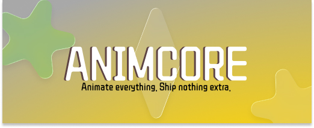

# AnimCore

Open-source animation engine — fast, lightweight, and free forever.

---

## What is AnimCore?

AnimCore lets you create and play smooth animations in any app or website. Think of it like the engine behind animated buttons, loading screens, character movements, or interactive UI effects.

It's built as an open alternative to tools like [Rive](https://rive.app) — with no subscriptions, no vendor lock-in, and no proprietary formats.

---

## Why AnimCore?

- **Free and open source** — always. No paid tiers, no locked features.
- **Tiny file sizes** — animations stay small, so your app stays fast.
- **Works everywhere** — web, mobile (iOS & Android), Flutter, game engines (Bevy), and desktop.
- **Smart animations** — supports state machines, so animations can react to user input (hover, click, speed, direction, etc.).
- **SVG friendly** — import existing SVG artwork directly.

---

## Current Status

Phases 1–8 are complete. AnimCore has a fully working runtime, GPU and CPU renderers, binary file format, state machines, platform runtimes (Web, Flutter/iOS, Bevy), and a desktop editor. Active development is now on Phase 9 advanced features.

| Area                          | Status         |
| ----------------------------- | -------------- |
| Animation playback            | ✅ Complete    |
| Visual effects & blend modes  | ✅ Complete    |
| SVG import / export           | ✅ Complete    |
| Advanced animation (mixing, IK, constraints) | ✅ Complete |
| State machines & blend trees  | ✅ Complete    |
| Binary `.anim` file format    | ✅ Complete    |
| GPU renderer (vello + wgpu)   | ✅ Complete    |
| CPU renderer (tiny-skia)      | ✅ Complete    |
| Web runtime (WASM)            | ✅ Complete    |
| Flutter / iOS runtime (C FFI) | ✅ Complete    |
| Bevy plugin                   | ✅ Complete    |
| Desktop editor (egui)         | ✅ Complete    |
| Skeleton rigging & mesh deform| 📅 Planned     |
| Text nodes                    | 📅 Planned     |
| Physics simulation            | 📅 Planned     |
| Lottie import / GIF export    | 📅 Planned     |

---

## Contributing

All contributions are welcome — code, design, docs, bug reports, or just trying it out and sharing feedback.

- **Found a bug?** Open an issue.
- **Have an idea?** Start a discussion.
- **Want to contribute code?** Open a pull request — one focused change per PR keeps things moving.

---

## License

MIT — free to use, modify, and distribute.
